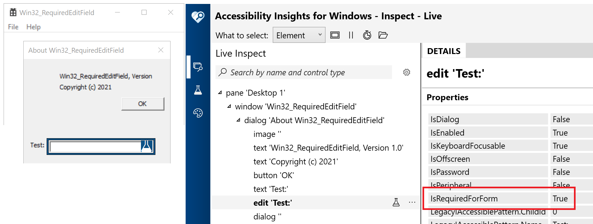

# Win32_RequiredEditField
A Win32 app based on the Visual Studio template, which demonstrates how to mark an edit field programmatically as being required. This means a screen reader will announce "required" when it encounters the field.

A while back I wrote [Text_LiveSetting](https://docs.microsoft.com/en-us/accessibility-tools-docs/items/Win32/Text_LiveSetting), which contains code snippets showing how to customize the UIA representation of Win32 controls for one specific purpose. I took that example and modified it to set a different UIA property on a control. I created this demo Win32 app from the VS template, added an edit field to the Help dlg, and then set the UIA IsRequiredForForm property on that field. With that change, Narrator announces "Required" when encountering the field. I've made the code public here, and put "Barker" near all the code of interest. 

The screenshot below shows the Accessibilty Insights for Windows tool reporting that the UIA IsRequiredForForm property on the edit field is true.

1. Use KeyboardNavigation.TabNavigation="Once" so that a tab press moves into a group of RadioButtons, and the next tab press moves out of that group. Customers don;t want tab to key keyboard focus between RadioButtons in the same group.
2. Use KeyboardNavigation.DirectionalNavigation="Cycle" so that an arrow key press does not take keyboard focus out of a RadioButton group.
3. For some types of UI,  arrowing between RadioButtons in a group the RadioButton gaining focus is selected. You may choose not to do that, as it means the behavior is not the same as that by default for other WPF apps. But I added the code anyway for your consideration.

